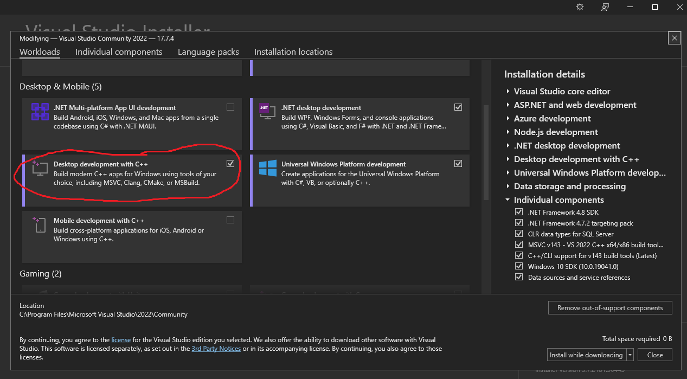

## Setting up the Development Computer

This section describes which software must be installed on a computer to run the project. That does not mean that newer or older versions will not work, but it's not guaranteed that they will.

- Microsoft Visual Studio Community 2022. Installing the workload *Desktop development with C++* (including the packages *MSVCv143 - VS 2022C+ x64/86 build tools* and *C++ATL for lastest*)

- [CMake](https://cmake.org/download/) >= 3.21.2
  - Use a Windows x64 installer from [here](https://cmake.org/download/). Visual Studio's integrated CMake support does not work.
  - Select the option "Add CMake to the system PATH for all users"

- Windows Subsystem for Linux (WSL). The required steps change occasionally and also depend on the previous state of the system and whether the WSL is used for other purposes. You should therefore consult Microsoft's documentation whenever you set up WSL for the project on a new Windows installation.
  - Ubuntu 22.04 must be selected as default distribution. Currently, Ubuntu 22.04 must be installed via the Microsoft Store
  - That distribution should use WSL version 1 due to frequent Windows file system access.
  - In that distribution, root must be the default user account. This can be achieved by pressing *Ctrl+C* when being prompted for a user name during installation of the distribution.
  - Packages need to be installed using the following commands in Windows *Command Prompt*.
    -   `wsl apt update`
    -   `wsl apt -y install astyle ccache clang cmake llvm mold net-tools ninja-build pigz rsync xxd lld`

- Git

## Setting up the Working Copy

Creating Project Files / Compiling the Code
- Run `Make\VS2019\generate.cmd` in Windows *Command Prompt*
- Open via link `Make\VS2019\B-Human.lnk`

Reference [Wiki B-Human 2021](https://wiki.b-human.de/coderelease2021/getting-started/) and [Wiki B-Human 2022](https://wiki.b-human.de/coderelease2022/getting-started/)